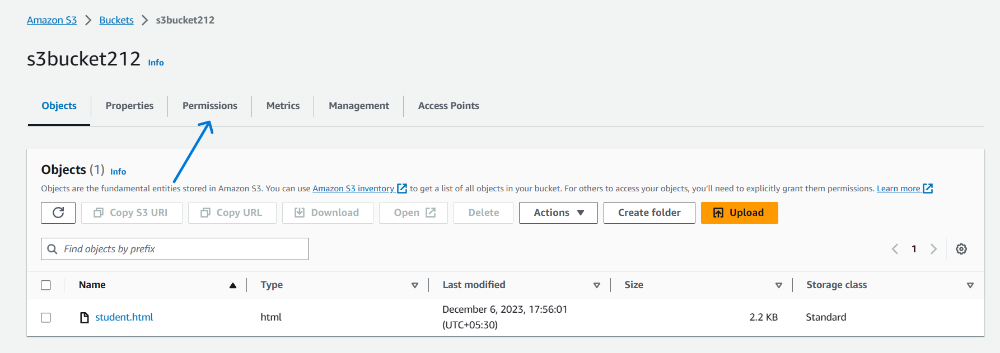
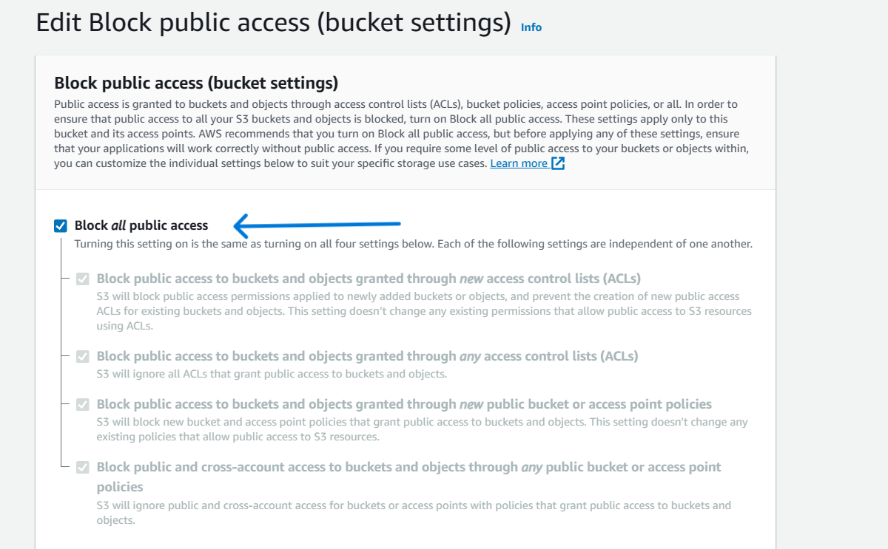
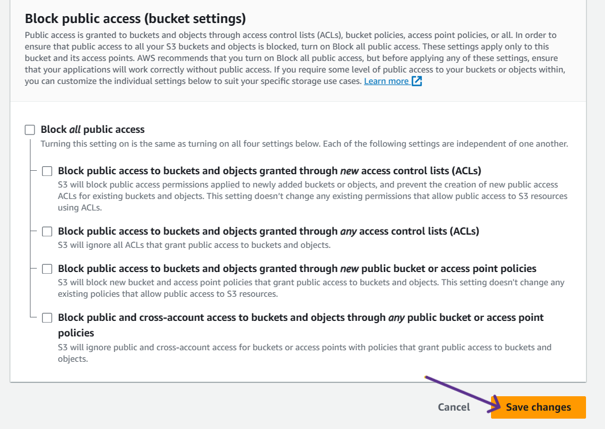
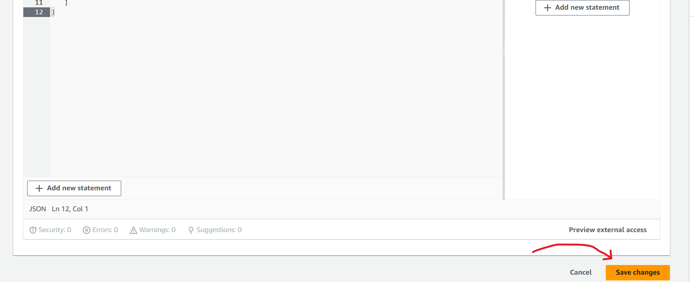

# To create AWS S3 Bucket, using ```AWS Console``` , ```AWS-CLI``` and  ```Powershell``` follow below steps :

## Pre-Requistes

- ### Make sure to Create a user in your aws console and have ```Access Key ID``` and ```Secret Access Key``` noted down in notepad.

## Process

# **AWS-Console**

- ### **Open the AWS-Console and search for S3 in the console , Start with giving ```Bucket Name```** .

  

- ### **Click on ``Create Bucket``** .

  

- ### **Now you can see that S3 Bucket got created succefully ``s3bucket212``** .

  

- ### **Now if you want to add any files to it , you can click on ```upload``` .**

  

- ### **Click on ``Add file.``**

  

- ### **We have taken a sample student app HTML file and added that to it**

  

- ### **it got uploaded**

  

- ### **Now under properties in storage class select ``Standard`` and click on ``Upload``** .

  

- ### **Uploaded Successfully.***

  

- ### **Now come back to the ``s3bucket212`` as we need to assign certain permissions to it , Click on ``Permissions``***

  

- ### **Here in Block Pulic access , click on ```edit```.***

  

- ### **Uncheck the Checkbox of it.**

  

- ### **Click on ``Save Changes``.**

  

- ### **Scroll down and come to Bucket Policy , Click on ``Edit``.**

  

- ### **Click on Add New Statement.**

  

- ### **Now make some changes to the policy as shown in below picture , just replacee resource with you resource name , as its placed above policy statement. Make sure to add ```/*``` to resource.**

  

- ### **Click on ```Save Changes```**

  


- ### **Now , lets open the ``student.html``**

  


- ### **Now , click on the ```Object URL```**

  

- ### **You can see student application Running Successfully**

  
