# <span style="color: gold;"> Introduction

- What is ``Amazon API Gateway`` ?

    ``Amazon API Gateway`` is a fully managed service that makes it easy for developers to create, publish, maintain, monitor, and secure APIs at any scale. APIs act as the "front door" for applications to access data, business logic, or functionality from your backend services. Using API Gateway, you can create RESTful APIs and WebSocket APIs that enable real-time two-way communication applications. API Gateway supports containerized and serverless workloads, as well as web applications.

## To create Amazon API Gateway, using ```AWS Console``` , ```AWS-CLI``` and  ```Powershell``` follow below steps :

1.[AWS Console](#aws-console)

2.[AWS-CLI](#aws-cli)

3.[Powershell](#powershell)

# <span style="color: gold;">Pre-Requistes

- ### Make sure to Create a user in your aws console and have ```Access Key ID``` and ```Secret Access Key``` noted down in notepad.

# <span style="color: gold;">Process

## <span style="color: pink;">**AWS-Console**

| Step | Description | Screenshot |
|------|-------------|------------|
| 1. | **Open the AWS Console and search for ``API``.** | 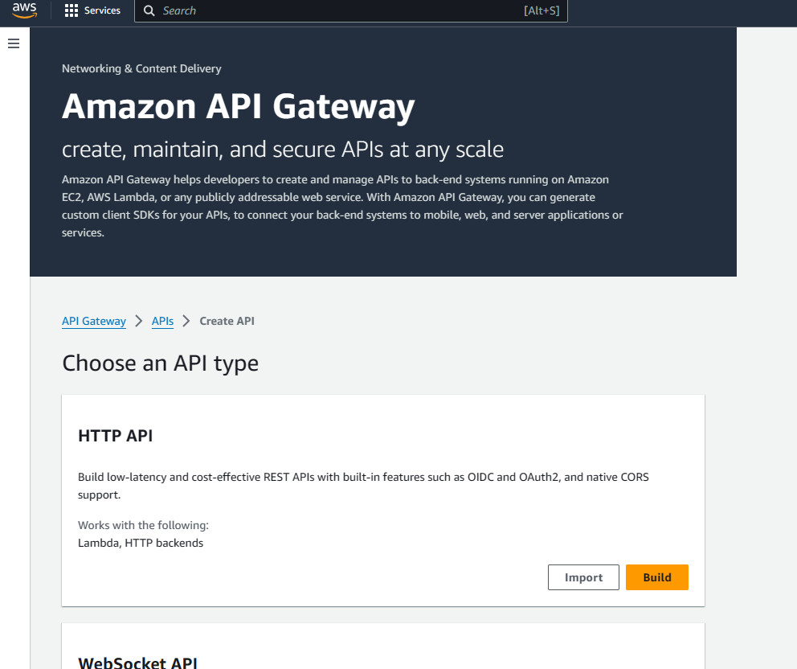 |
| 2. | **Scroll down and , lets try to create ``REST API``. Click on ``Build``.** | 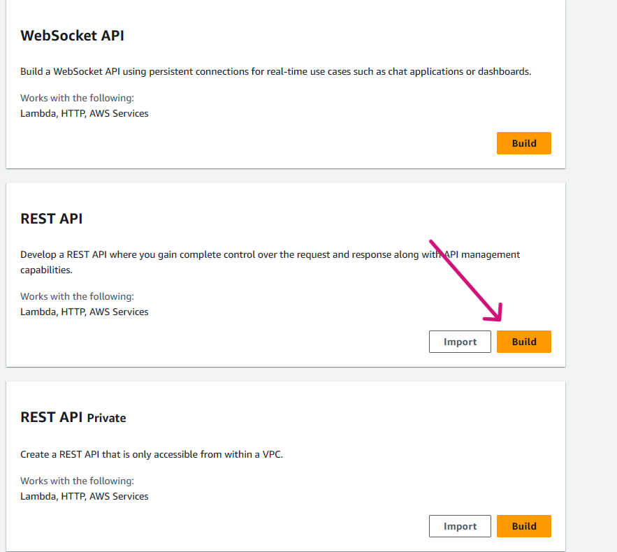 |
| 3. | **Lets create ``New API`` and give the ``API Name``and Click on ``Create API``** |  |
| 4. | **The ``REST API`` got create successfully.Now lets click on ``Create resource``**. | 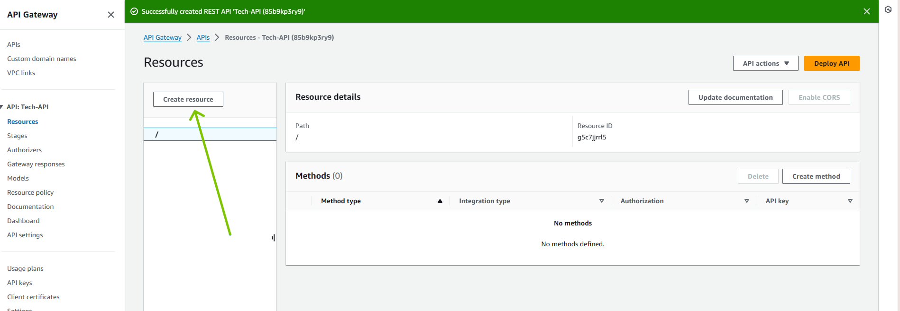 |
| 5. | **Give the ``Resource Name`` and Click on ``Create Resource``.** |  | 
| 6. | **The Resource got created successfully , Now lets create `Method`.** |  |
| 7. | **Select the ``Method Type`` as your choice , we are going with ``GET`` & Integration type for Demo purpose you can choose ``Mock``. And click on ``Create Method``** .| 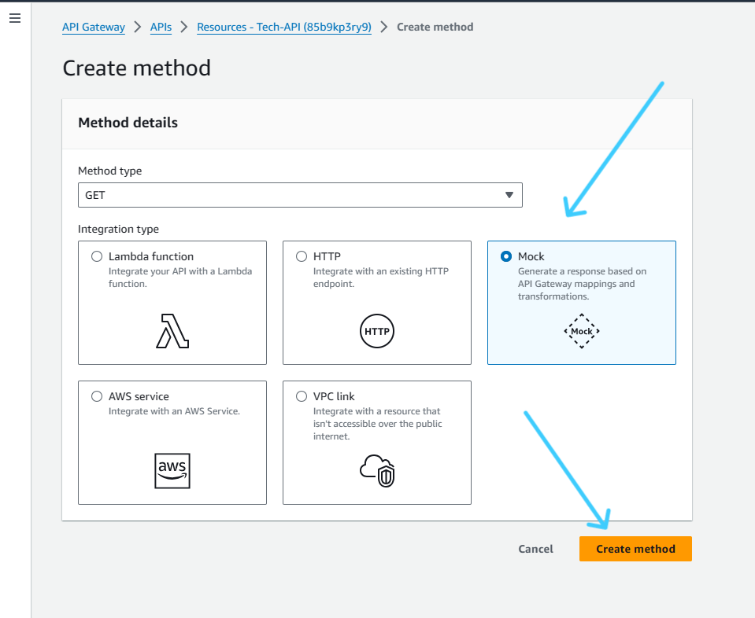 |
| 8. | **The Method got created successfully.In Method execution , lets go with ``Integration response``.**| 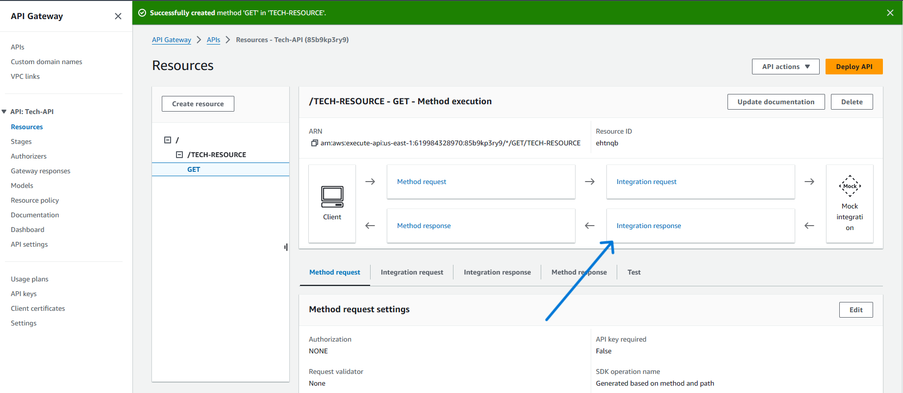 |
| 9. | **So, under ``Integration response`` click on ``Edit``.** | 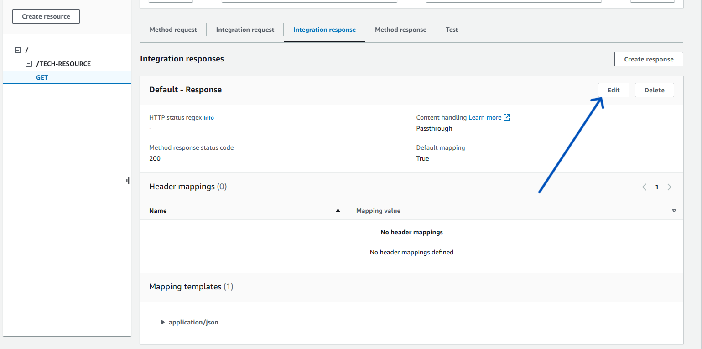 |
| 10.|**Edit integration response page has appeared, Please scroll down** | 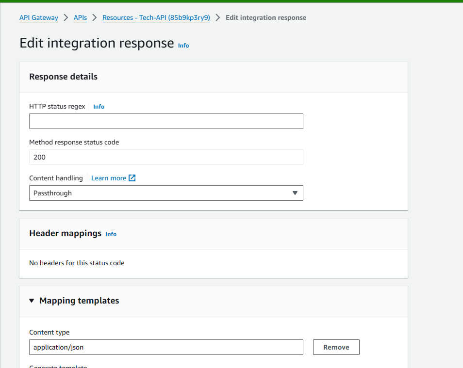 |
| 11.|**Under ``Mapping Templates`` , give some json sample query according to your wish and Click on ``Update``.** | 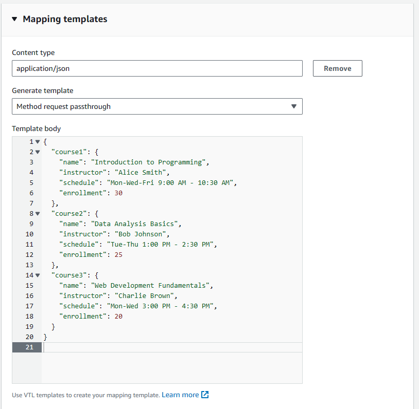 |
| 12.|**The ``Integration response`` got updated sucessfully . Now Click on ``Deploy API``.** | 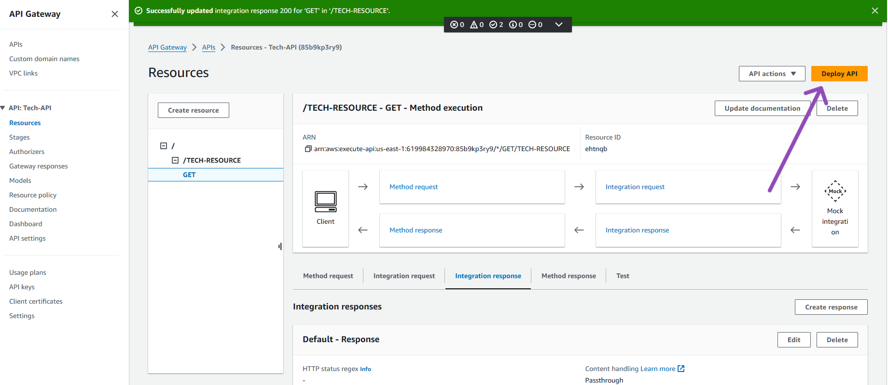 |
| 13.|**Go with the ``New Stage`` and give the ``Stage Name`` along with ``Description``. Click on ``Deploy``.** | 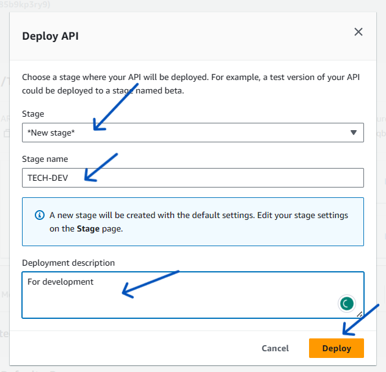 |
| 14.|**The API got deployed successfully , Now copy the ``Invoke URL``** | 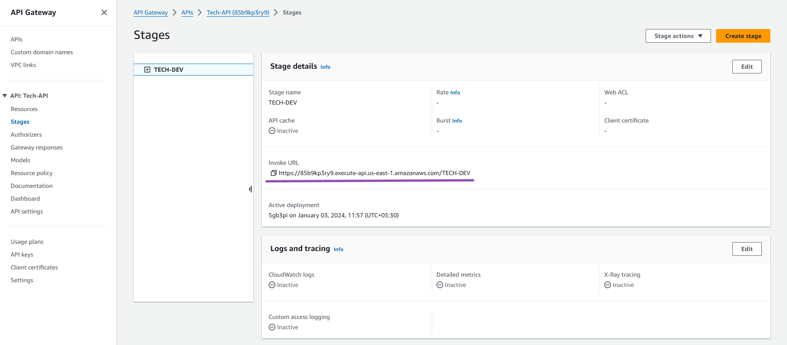 |
| 15.|**Open the New Tab and paste the ``URL`` aling with ``/Resource-Name`` . And you can see the Json Syntax appearing.** | 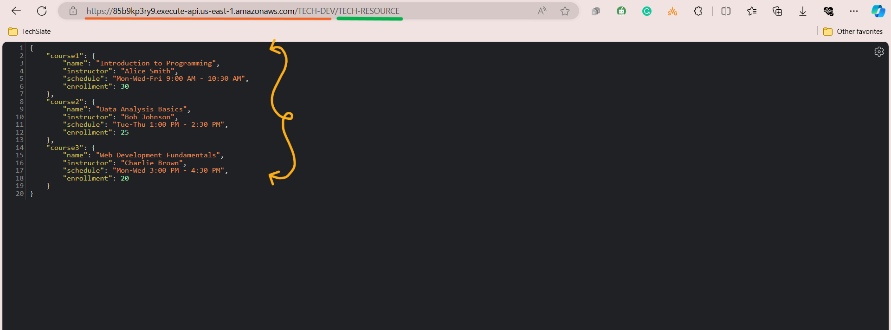 |

***
<br>

## <span style="color: pink;">**AWS-CLI**


| Step | Description | Screenshot |
|------|-------------|------------|
| 1. | **Open the command line of your choice and run following command with provided **Access Key ID** and **Secret Access Key**** <br> ``aws configure`` |  |
| 2. | **Lets run the following command to ``create REST-API`` using AWS-Cli Command.** <br> </br>``aws apigateway create-rest-api --name API-Name --region us-east-1``|  |
| 3. | **Run the following get-resources CLI command to retrieve the root resource identifier of the RestApi.** <br> </br>``aws apigateway get-resources --rest-api-id 95rbc**** --region us-east-1 ``. **You can get the ``--resr-api-id`` from above output.**| 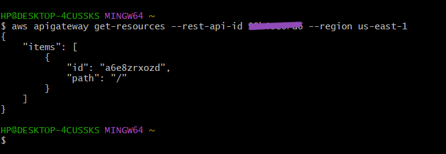 |
| 4. | **Use the following create-resource command to add a resource (ip) under API**. <br> </br> ``aws apigateway create-resource --rest-api-id 95rbc**** --region us-west-1 --parent-id zw1g9tpoo9 --path-part ip`` . | 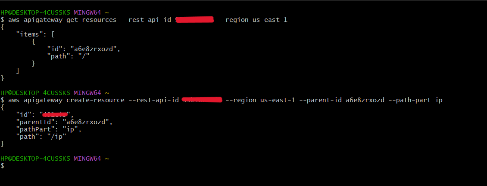 |
| 5. | **Now , run put-method CLI command to add the GET HTTP method on the ``/ip`` resource.**.|  |
| 6. | **Now , run the put-method-response command to set up the 200 OK response of the GET /ip method. For this resource we just need a 200 OK response**.<br> </br> ``aws apigateway put-method-response --rest-api-id 95rbc**** --resource-id 5zxtsd  --http-method GET --status-code 200 --region us-east-1``.|  |
| 7. | **Now , lets run the put-integration command to set up an Integration with a https://httpbin.org/ip HTTP endpoint for the GET /ip method.**. <br> </br> ``aws apigateway put-integration --rest-api-id 95rbc**** --resource-id 5zxtsd --http-method GET --type HTTP --integration-http-method GET --uri 'https://httpbin.org/ip' --region us-east-1``.|  |
| 8. | **Lets also run the put-integration-response command to create an IntegrationResponse of the GET /ip method integrated with an HTTP backend** <br> </br> ``aws apigateway put-integration-response --rest-api-id 95rb**** --resource-id 5zxtsd --http-method GET --status-code 200 --selection-pattern "" --region us-east-1``.|  |
| 9. | **Proceeding further lets  Deploy the API to a stage , using create-deployment CLI command.** <br> </br> ``aws apigateway create-deployment --rest-api-id 95rbc**** --region us-east-1 --stage-name test --stage-description 'Test stage' --description 'First deployment'``.|  |
| 10. | **Now , lets head back to console and check whether key got created**.|  |
| 11. | **Go to the ``Stages`` section and copy the ``Invoke URL``**.| 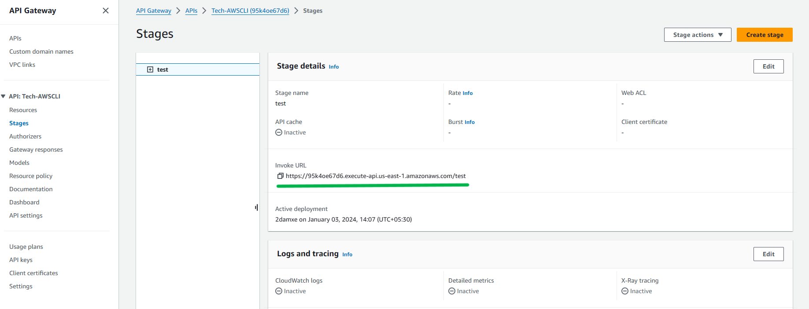 |
| 12. | **Open the New tab and paste the URL along with Resource name ``/ip``**.|  |


## <span style="color: pink;"> **POWERSHELL**

 ## PowerShell Pre-requisites

 -      Install-Module -Name AWSPowerShell -Force -AllowClobber

 -      Import-Module AWSPowerShell

