#  Introduction

- What is ``AWS App Runner`` ?

    AWS App Runner is a fully managed service that makes it easy for you to build, deploy, and scale containerized web applications quickly. It abstracts away the complexity of infrastructure management and provides a streamlined experience for developers. 


## To create ``AWS App Runner``, using ```AWS Console``` , ```AWS-CLI``` and  ```Powershell``` follow below steps :

1.[AWS Console](#aws-console)

2.[AWS-CLI](#aws-cli)

3.[Powershell](#powershell)

## Pre-Requistes

- ### Make sure to Create a user in your aws console and have ```Access Key ID``` and ```Secret Access Key``` noted down in notepad.

- ### Also , Please make sure to assign the following policy to the user with respect to ```AWS AppRunner```.

  ```AmazonEC2ContainerRegistryFullAccess```

   

## Process

# **AWS-Console**

- ### **Open the AWS-Console and search for ``AWS App Runner`` in the console . Click on ```Create Service```**.

  

- ### **In the first place to proceed further we need Container image URI , So lets create one repo and image for this** .

  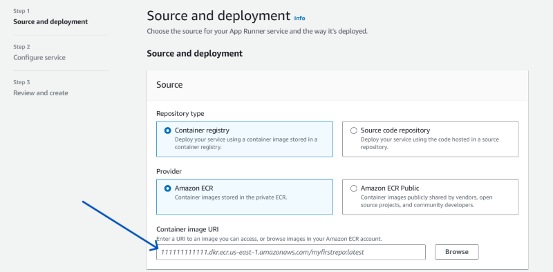

- ### **Go to the search box and search for ECR (Amazon Elastic Container Registry) and click on ```Create repository```** .

  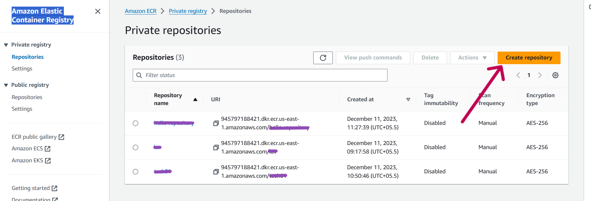

- ### **Let's keep the repository ```Private``` along with that give some name to your repository .**

  

- ### **Now Repository creation is done , To create image we need to Dockerfile, Which we have already created for you.**

  

- ### **Now come back to Repository and click on ```View Push commands``` , by running them we can see image is been creating inside repository**.

  

- ### **Run all of the commands one by one !**

  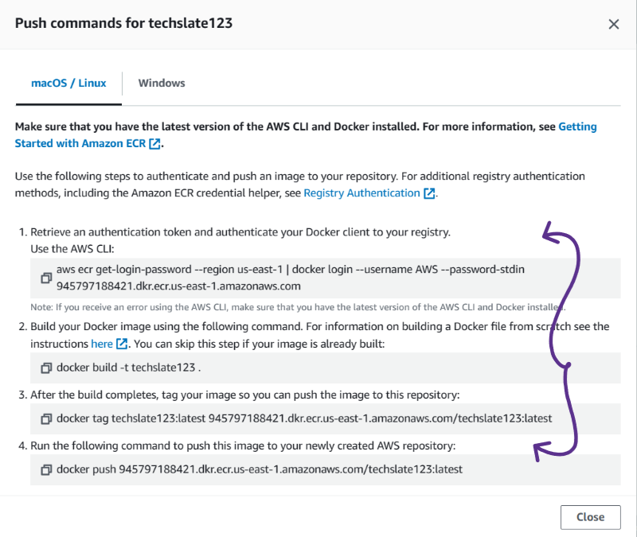

- ### **All of the commands are run successfully !** .

  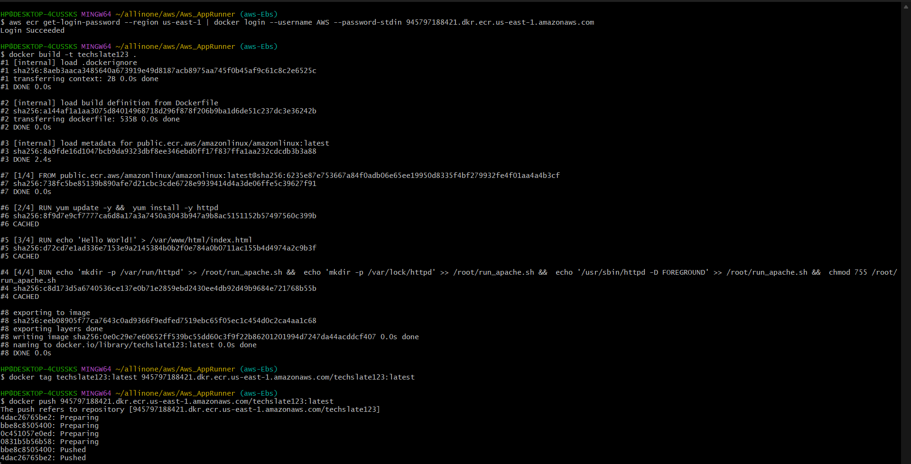

- ### **Lets go back to repository and see if image is reflecting their.And we can see it perfectly.**

  

- ### **Open the image and copy the URI and move back to the page of AWS AppRunner.**

  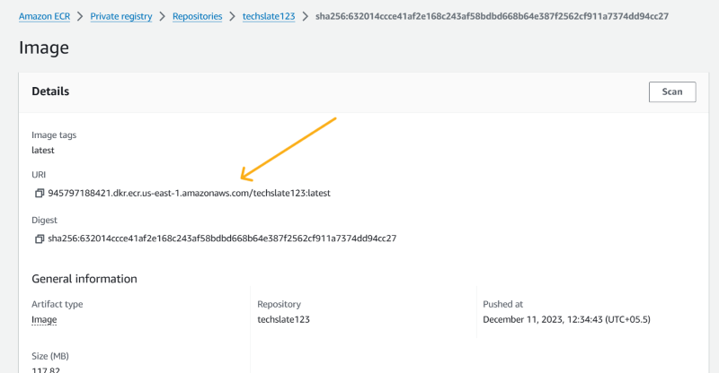

- ### **Past the URI here.**

  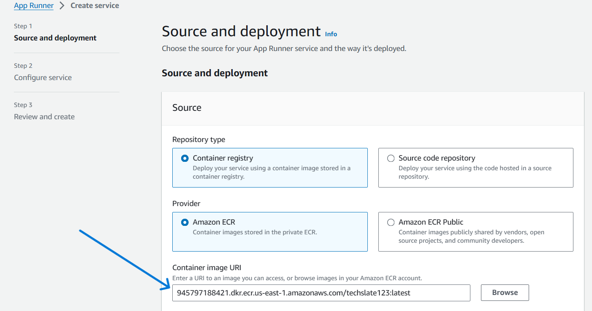

- ### **In ECR access Role , Click on ```Create new service role```.**

  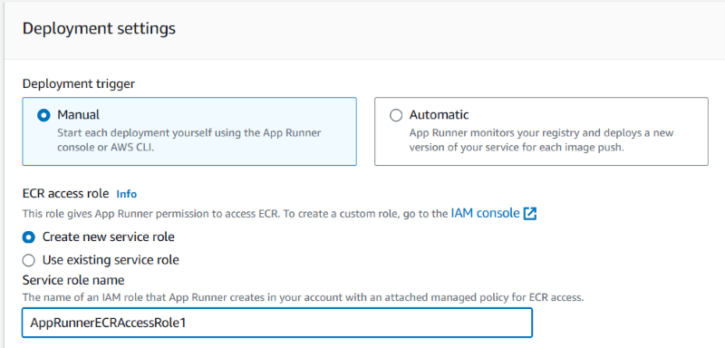

- ### **Moving further give the proper ```Service name```.**

  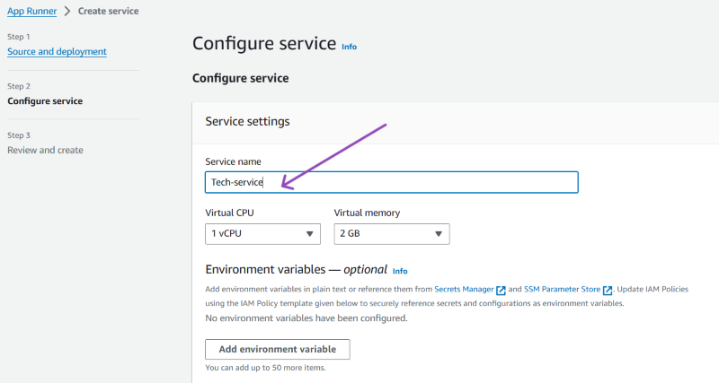

- ### **Just Scroll down and Click on ```Next```**.

  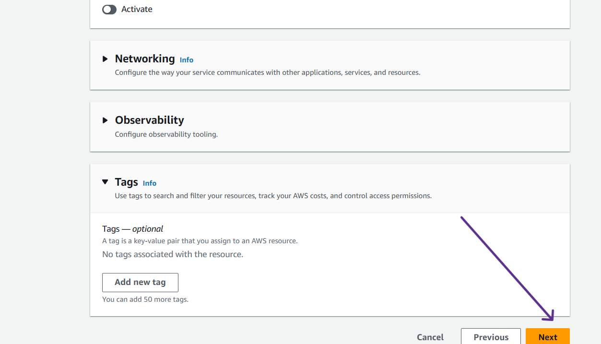

- ### **Now in Review and Create just check if everything is properly given. and Click on ```Create and Deploy```.**

  

- ### **It will take time to process , Lets wait.**

  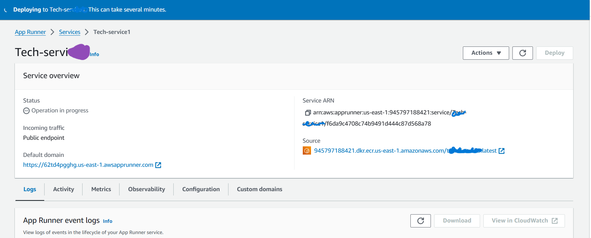

- ### **Here it is , The service got deployed Successfully .**

  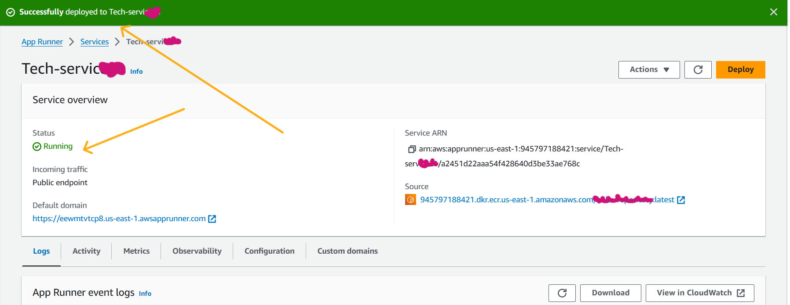

- ### **Click on the ```Default Domain```**

  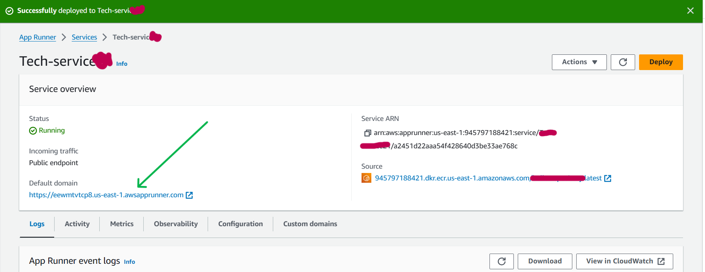


- ### **Here it is , we can ```Hello-World !``` appearing on the page**

  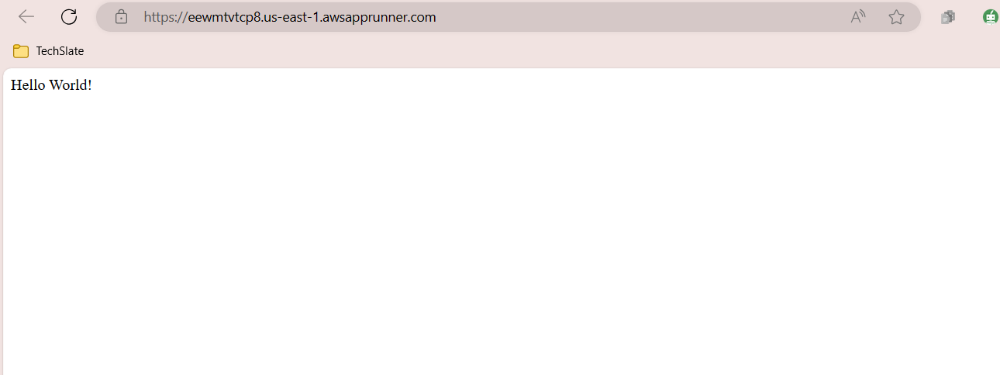


# **AWS-Cli**


# **powershell**

***