#  Introduction

- What is ``Amazon Elastic Beanstalk`` ?

    Amazon Elastic Beanstalk is an easy-to-use service for deploying and scaling web applications and services developed with Java, .NET, PHP, Node.js, Python, Ruby, Go, and Docker on familiar servers such as Apache, Nginx, Passenger, and IIS.


## To create ``Amazon Elastic Beanstalk``, using ```AWS Console``` , ```AWS-CLI``` and  ```Powershell``` follow below steps :

1.[AWS Console](#aws-console)

2.[AWS-CLI](#aws-cli)

3.[Powershell](#powershell)

## Pre-Requistes

- ### Make sure to Create a user in your aws console and have ```Access Key ID``` and ```Secret Access Key``` noted down in notepad.

- ### Also , Please make sure to assign some policies to the user with respect to ```AWS-Elastic-Beanstalk```.


## Process

# **AWS-Console**

- ### **Open the AWS-Console and search for ``Elastic Beanstalk`` in the console , So there are 2 things to create here ```Application``` and ```Environment``` . Click on ```Application```

  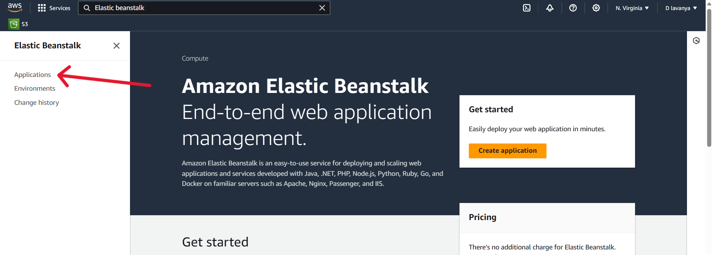

- ### **Click on ``Create Application``** .

  

- ### **Give the Application name** .

  

- ### **Click on ```Create```.**

  

- ### **Now Click on ```Create Environment```**

  

- ### **Here , the Application name is already been recognised , Let's move to the next steps**.

  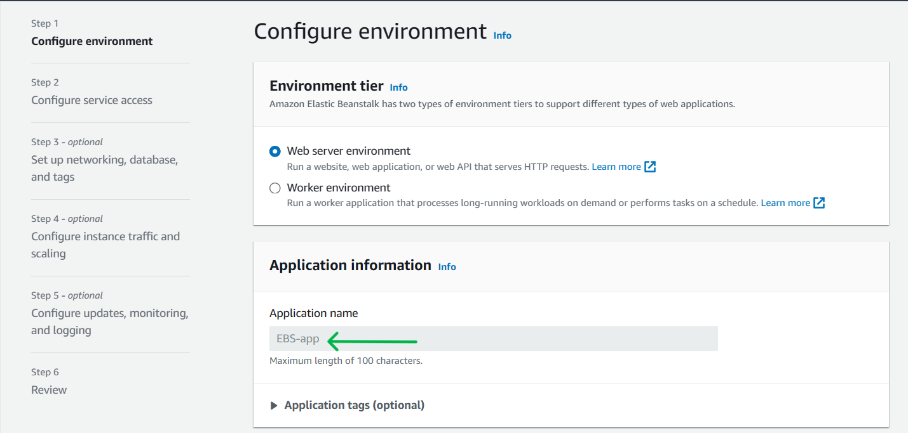

- ### **Coming to the Environment Information , it has suggested some name lets keep the same and Domain lets take default.**

  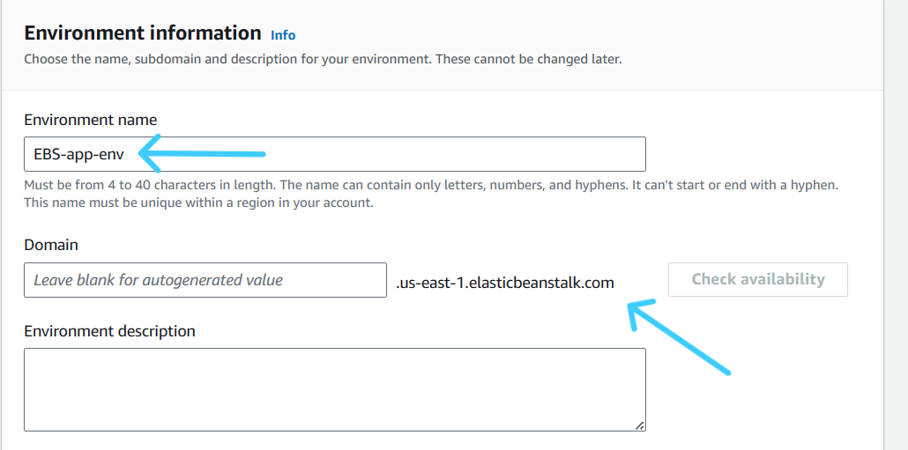

- ### **Now lets move to the Platform , select the platform of your wish , for now lets take ```Php```** .

  

- ### **Let the ```Application code``` and ```Presets``` remain same , Click on ```Next```**

  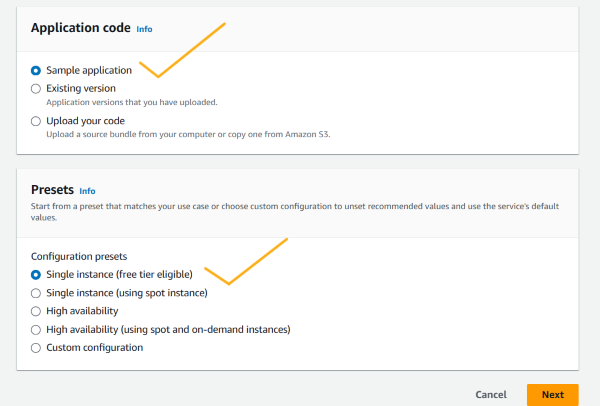

- ### **Coming to service access , Lets go with ```Create and use new service role```**

  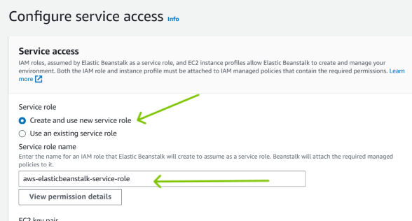

- ### **Now to move further we need to have ```EC2 Instance profile``` .**

  

- ### **You can also follow the AWS developer guide as well which will give a clean steps to proceed further.**

     ### https://docs.aws.amazon.com/elasticbeanstalk/latest/dg/environments-create-wizard.html

     

- ### **So, lets Go to ```IAM``` , Click on ```Roles``` & Click on ```Create Role```.

  

- ### **Let the Trusted entity be ```AWS Service``` and Use Case be ```EC2```. Click on ```Next```**.

  

- ### **Now we need to attach the policies to the role as mentioned in the document which is mentioned below.**

  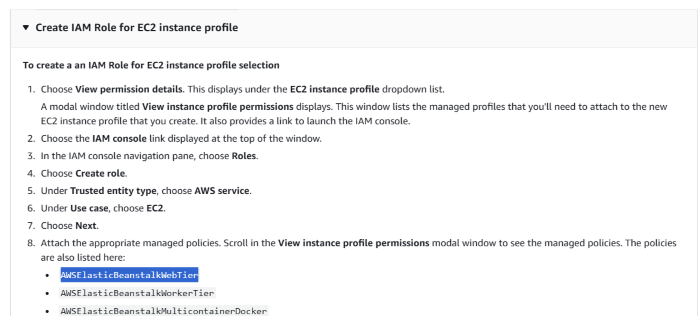

- ### **So, search for the policy , select that and click on ```Next```.**

  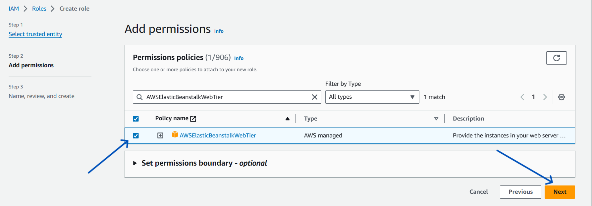

- ### **Give the proper ```Role name``` .**

  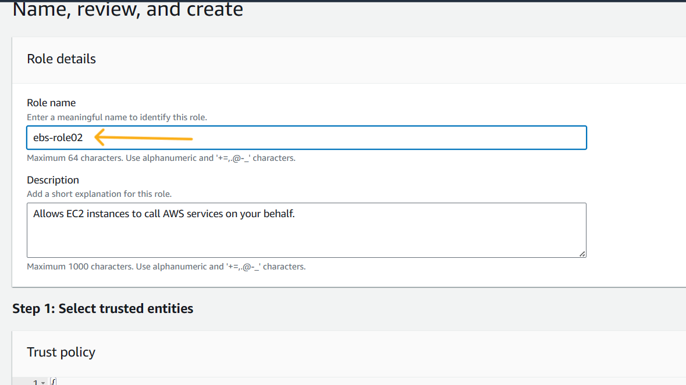

- ### **Click on ```Create Role```**

  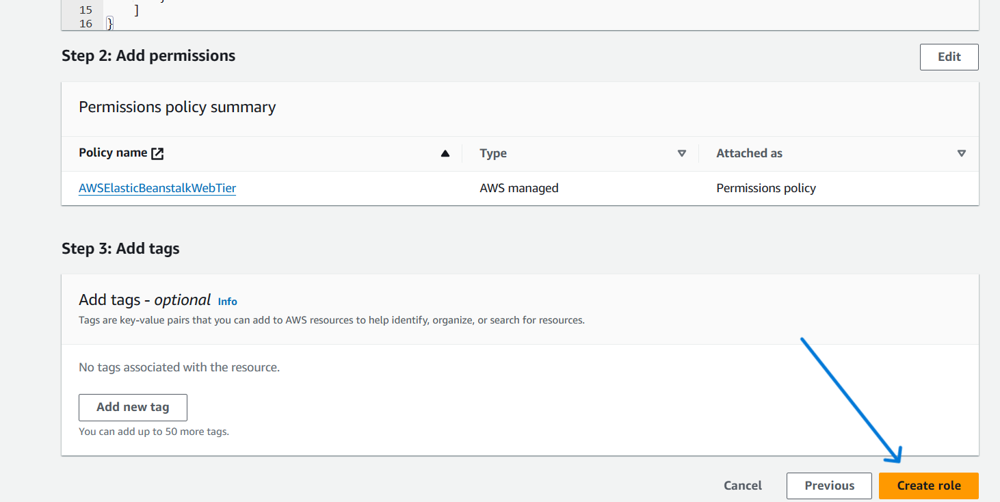


- ### **So, the role got successfully created.``**

  


- ### **Now , lets switch back to the tab where , we had to enter ```EC2 instance profile``` And now we can choose our role here. Click on ```Next```**

  

- ### **Here in ```VPC``` , Select the default one which is already provided.**
  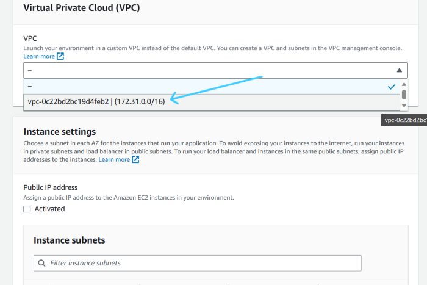

- ### **Moving further , in ```Instance Subnets``` , Choose the random one.**
  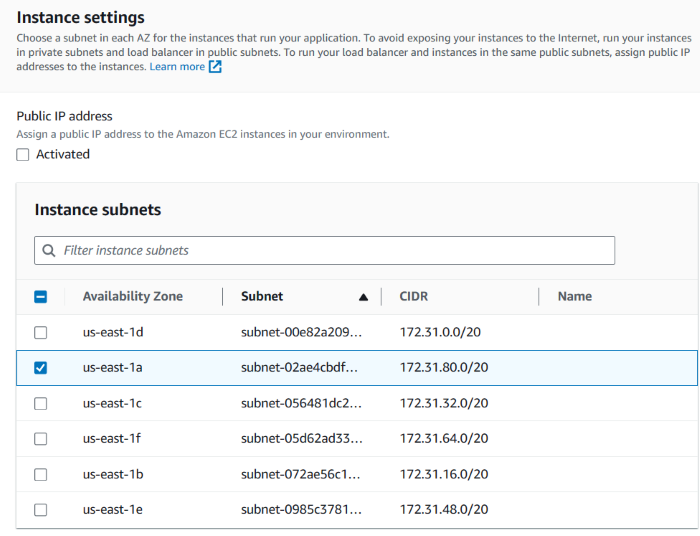

- ### **Straightly come down and click on ```Next```**
  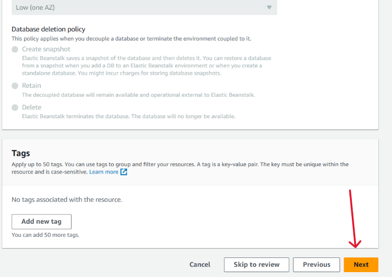

- ### **Under the Instances->Root Volume , Let everything remain same**
  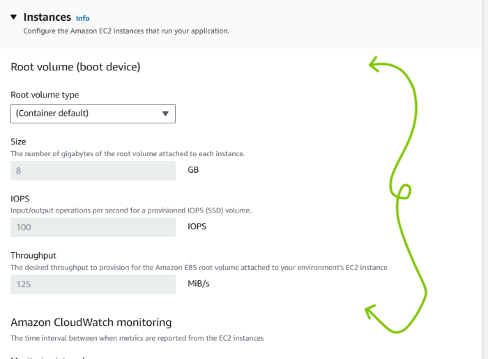

- ### **Under ```EC2 Security Groups``` keep it ```default```**
  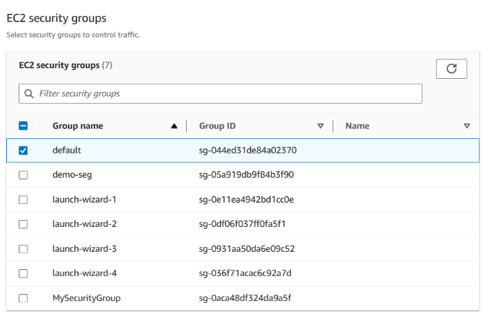

- ### **So , Just scroll down and click on ```Next```**
  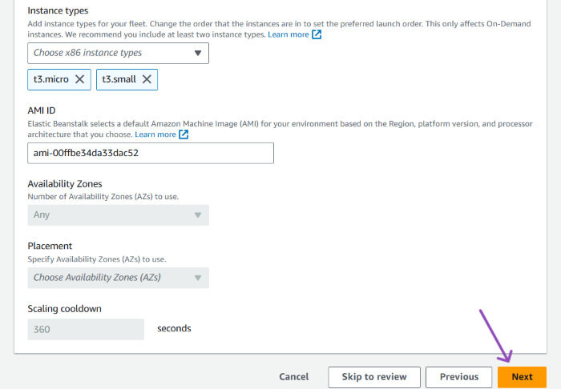

- ### **Coming to the next step , Under Monitoring the whole step keep it as it as and click on  ```Next```**
  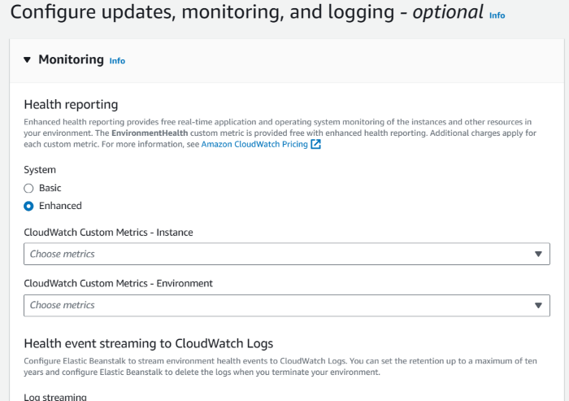

- ### **The final step is Review , just check everything and click on  ```Submit```**
  

- ### **It take some time to create , lets wait for it to create**
  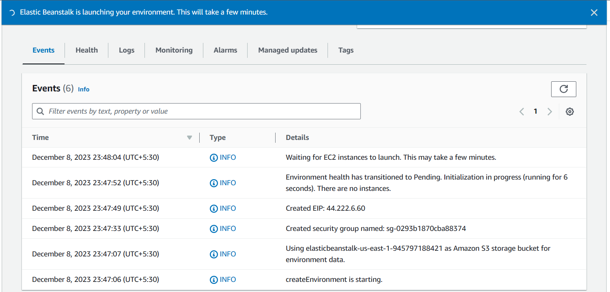

 - ### **The environment is successfully created. Just click on domain URl to access the app .**
  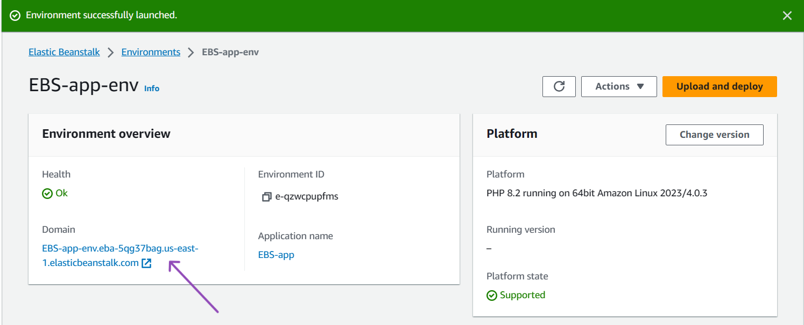
 
 - ### **we can see that the app is running.**
  
***
<br>

# **AWS-CLI**

- ### Open the command line of your choice and run following command with provided **Access Key ID** and **Secret Access Key** .

      aws configure 

    

- ### Lets run the following command to create application using AWS-Cli Command.

      aws elasticbeanstalk create-application --application-name MyEBApp

    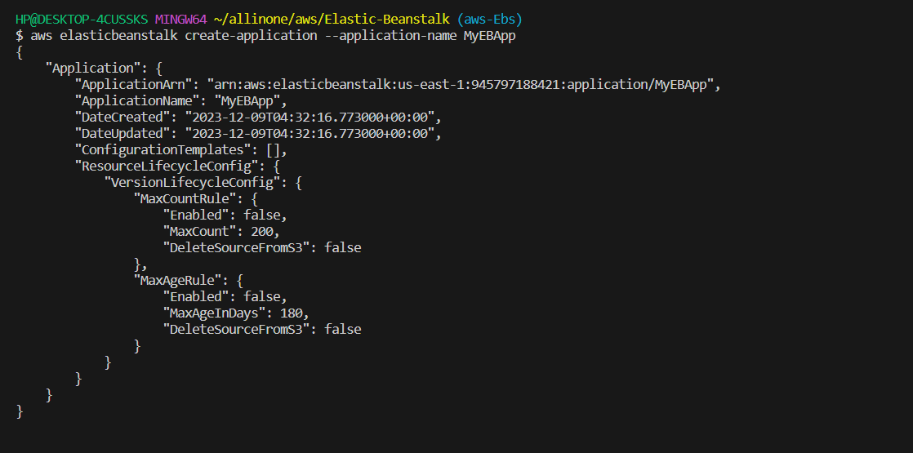

- ### Next, Let's Create an environment within the application.

       aws elasticbeanstalk create-environment   --application-name MyEBApp   --environment-name MyEBEnvironment   --solution-stack-name "64bit Amazon Linux 2018.03 v2.9.11 running PHP 5.4"

   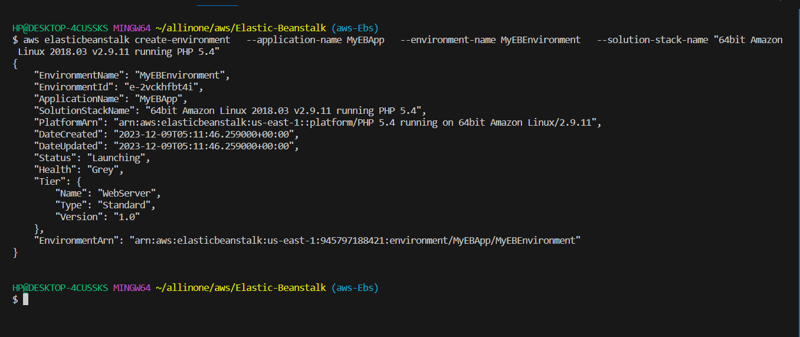


# **POWERSHELL**