#  Introduction

- What is ```Amazon Elastic Container Service (Amazon ECS) ```?

    Amazon Elastic Container Service (Amazon ECS) is a highly scalable and fast container management service that makes it easy to run, stop, and manage containers on a cluster.


## To create ``AWS ECS``, using ```AWS Console``` , ```AWS-CLI``` and  ```Powershell``` follow below steps :

## Pre-Requistes

- ### Make sure to Create a user in your aws console and have ```Access Key ID``` and ```Secret Access Key``` noted down in notepad.

- ### Also , Please make sure to assign some policies to the user with respect to ```AWS ECS```. Assign below polcy to you User .

      1. AmazonEC2ContainerRegistryFullAccess
 
    


## Process


# **AWS-Console**

- ### **Open the AWS-Console and search for ``Amazon Elastic Container Service`` in the console search box. Click on ```Create Cluster``` .**

    

- ### **Give the ```Cluster Name``` and Infrastructure as  ```AWS Fargate (serverless)``` as your choice .**

    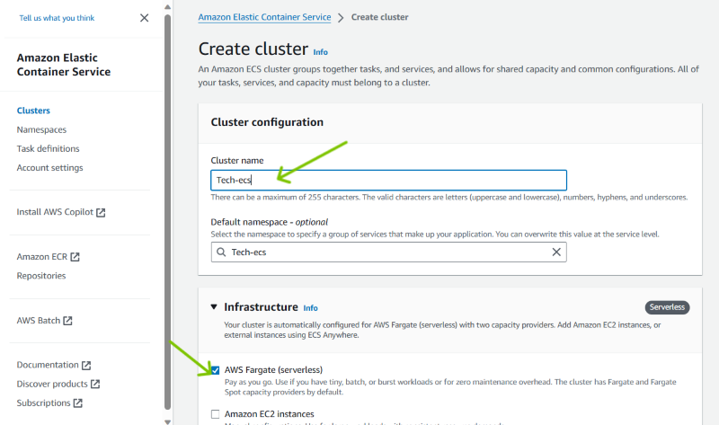

- ### **Click on ```Create```.**

    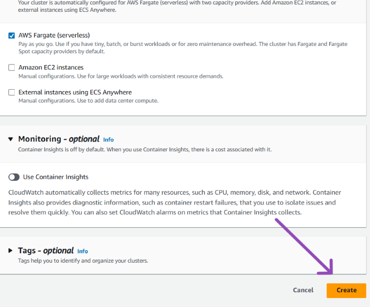

- ### **The Cluster is successfully created. Next step is to create ```Task Definition``` .**

    

- ### **Give a proper name to ```Task definition``` and Launch Type as ```AWS Fargate``` .**

    

- ### **Moving further , we need to create a container for that we need an Image ``Name`` and ``Image URI``. So, You can the respective image URI from ECR Public Gallery https://gallery.ecr.aws/ .**

    

- ### **Just leave remaining thing as default and Click on ``Create``.**

    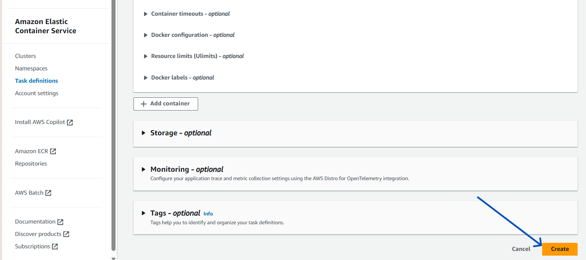

- ### **The Task definition got created Successsfully.**

    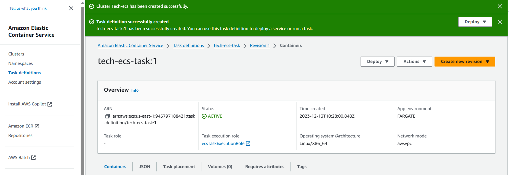

- ### **Now , Click on Deploy and select ``Create Service`` .**

    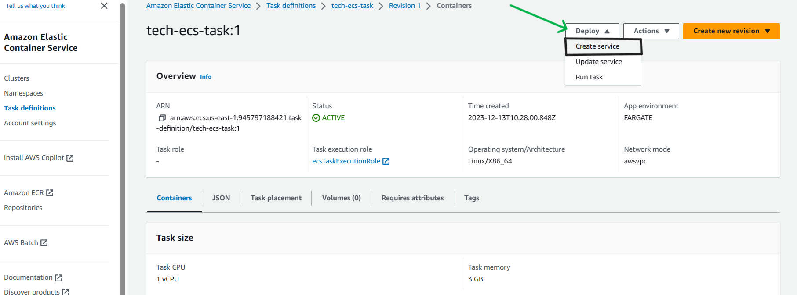

- ### **Now , Proceed further and give the ``cluster name`` that you have created before .**

    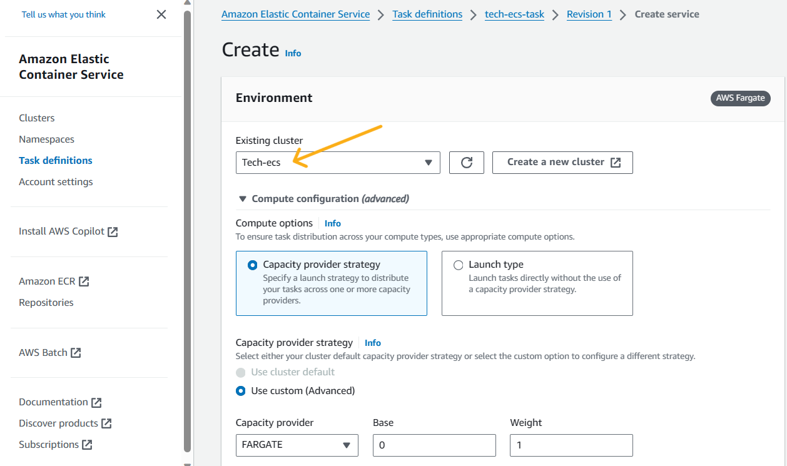

- ### **Keeping everything deafult moving further, Here give the ``Service name``.**

    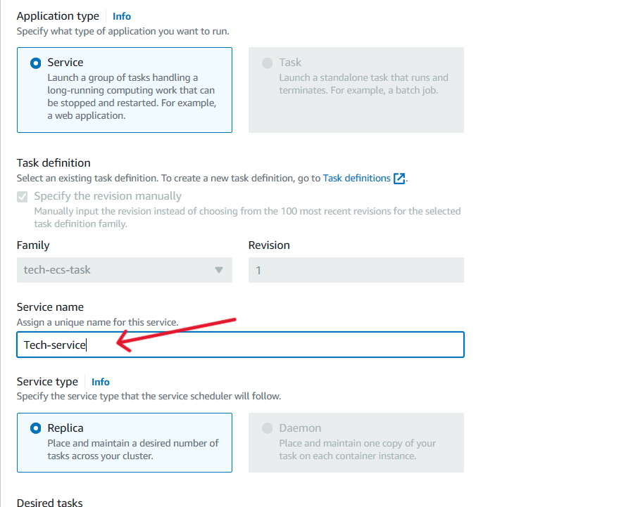   

- ### **Moving further , keep everything default and coming to ``Networking`` section , under ``security group`` choose ``Create a new security group``. Give ``security Group name`` and ``Description`` .**

    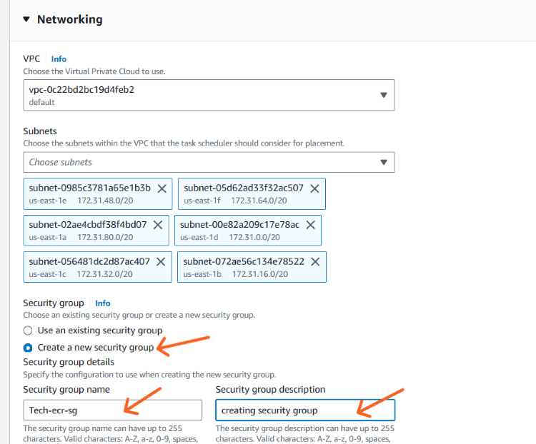  

- ### **Under Inbound rules for security group , Select TYPE as ``HTTP`` & SOURCE as ``Anywhere``. And click on ``Create``**.

    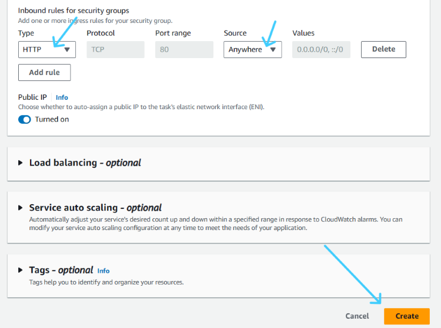   

- ### **So , under Cluster you can see that ``Service`` got created successfully**.

      

- ### **So , Now click on the service , you can see your task running and Click on the Public IP > open address**.

    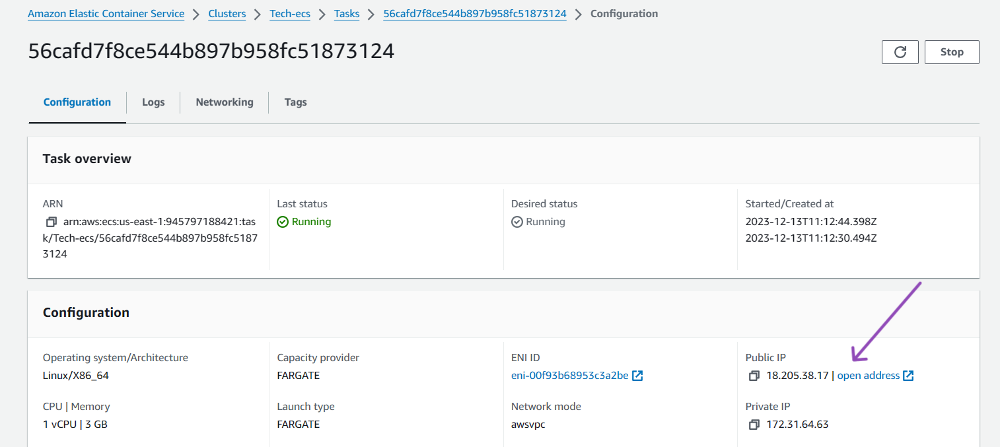  

- ### **Here you go , and you can see Nginx is running successfully**.

     

<br>
<hr>

# **AWS-CLI**
- ### Open the command line of your choice and run following command with provided **Access Key ID** and **Secret Access Key** .

      aws configure 

    

- ### Add the necessary ECS permissions as an inline policy. For the ecs:CreateCluster action, you can add the following policy to the User.
         {
            "Effect": "Allow",
            "Action": "ecs:CreateCluster",
            "Resource": "*"
         }

- ### Create an ECS Cluster by running the following command .

      aws ecs create-cluster --cluster-name your-cluster-name

    

- ### Before you can run a service, you need to define a task. A task definition describes how a Docker container should be launched, including the Docker image, CPU and memory requirements, etc.Run the following command :
  
- ### Add the necessary ECS permissions to the policy. For the ecs:RegisterTaskDefinition action, you can add the following statement to the policy:
       {
         "Effect": "Allow",
         "Action": "ecs:RegisterTaskDefinition",
         "Resource": "*"
       }

* ### Run the following command

        aws ecs register-task-definition --family tech-cli-task  --container-definitions '[{"name":"techslate-cli","image":"public.ecr.aws/nginx/nginx:mainline-alpine","memory":512}]'

    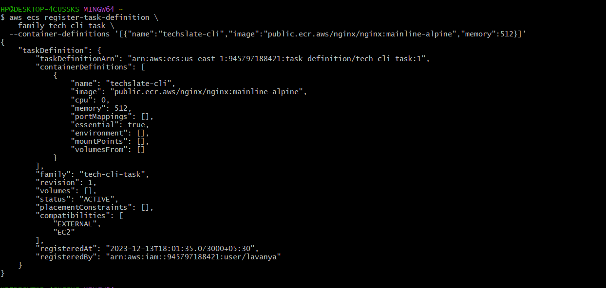

- ### Once you have a cluster and a task definition, you can run a service:

- ### Add the necessary ECS permissions to the policy. For the ecs:CreateService action, you can add the following statement to the policy:

      {
        "Effect": "Allow",
        "Action": "ecs:CreateService",
        "Resource": "arn:aws:ecs:us-east-1:945797188421:service/techslate-cli/tech-cli-service"
      }

- ### Run the following command to create ``Service`` .

      aws ecs create-service --cluster techslate-cli --service-name tech-cli-service --task-definition tech-cli-task --desired-count 1

    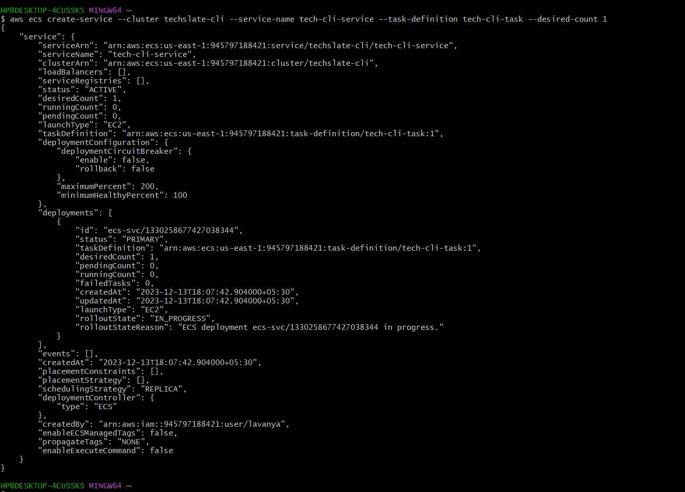


- ### Create a task set in a service that uses an external deployment controller. Before we create Tasks under service , lets add a policy to the user which is mentioned below :

      {
        "Effect": "Allow",
        "Action": "ecs:CreateTaskSet",
        "Resource": "*"
      }

- ### Run the following command to create ``Tasks`` under Service .

