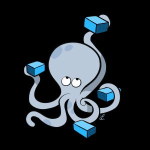
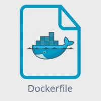

# Introduction 

## *This page contains all the Best-Practices of Docker.*

# Docker Compose-Best Practices 

## **Practice 1:**##

- Keep your docker-compose file version controlled (SCM) and next to the application code. 
Your Docker Compose file is there to describe your application components. This means any changes in your application should be reflected in your Docker Compose file. Changes to the port of a service or a new service added to the application should be made in your Docker Compose file as well.

- That’s why the best place for your Docker Compose file is next to your app and version-controlled in lockstep with your application.
Keep Docker images explicitly versioned.

## **Practice 2: Always use defined volumes.** ## 

- Docker Compose allows you to define volumes for each service the same way they are defined with the docker run command. While this is possible, it is not advisable. The best way to use volumes in Docker Compose is to define the named volumes on top of your Compose file and use those names.

## **Practice 3: Make your containers traceable to codebase.** ##

- Use a naming convention that allows you to look at a running container and tell you exactly how that container was built, using which git repo and using which Dockerfile.

- Make your containers traceable to git commit — Use git ref as the tag for the containers running.

## **Practice 4: Make sure your services return the correct exit code. ** ##

- We all use logging or console output to show errors in our apps. In a containerized world, exit codes have a special place. Orchestrators (like Compose, Swarm, and Kubernetes) use exit codes to tell if a service started or failed to start.

- The change of behavior in starting containers between Compose and Swarm means exist codes are even more important. While Docker Compose allows defining service dependencies, Docker Swarm (and Kubernetes) keep trying to start a crashing container (that exits with a code other than 0) several times.

- This means you need to make sure not only errors are logged but the exit codes are accurate as they will show up in the orchestrator’s logs and can give you valuable clues as to what’s going on with your application.

## **Practice 5: In a docker-compose file, mention the important services first—it is usually considered good practice to first mention the image for a service.** ##

For a service, group the parameter categories-

- Networking configurations should be kept close together.

- Security things as well.

- It’s also good to keep entrypoint and command next to each other.

## **Practice 6: Sort services alphabetically-** ##

- If docker-compose files grow with time, then it’s tedious to find services. If the services are ordered alphabetically, then it will be easy to find them.

## **Practice7: Using volume folder mapping (instead of a file mapping)** ##

- Folder mapping allows us to place multiple environment files that may be required for different scripts

- After restarting your containers, they will use the updated variables.

## **Practice8: Use docker-compose.yml as much as possible.** ##  
  
<pre>

</pre>   

    
# Docker File-Best Practices

## **Practice 1 : Use a.dockerignore file.** ##

- The best way is to put the Dockerfile inside the empty directory and then add only the application and configuration files required for building the Docker image.

- To increase the build’s performance, you can exclude files and directories by adding an a.dockerignore file to that directory as well.

## **Practice 2: Containers should be immutable and ephemeral.** ##

- The container created with the image produced by Dockerfile should be ephemeral and immutable. In other words, the container should be destroyed and a new one built and put in place with an absolute minimum set-up and configuration.

## **Practice 3: Minimize the number of layers and consolidate instructions.** ##

- Each instruction in the Dockerfile adds an extra layer to the Docker image. The number of instructions and layers should be kept to a minimum as this ultimately affects build performance and time.

## **Practice 4: Avoid installing unnecessary packages** ##

In order to reduce complexity, dependencies, file sizes, and build times, avoid installing unnecessary packages.

## **Practice 5 : Sort multi-line arguments** ##

Sorting multiline arguments alphanumerically will help avoid duplication of packages and make the list much easier to update.

## **Practice 6 : Build cache** ##

- While building an image, Docker will step through the instructions mentioned in the Dockerfile, executing them in chronological order. As each instruction is examined, Docker will look for an existing image layer in its cache that it can reuse, rather than creating a new image layer.

- However, when Docker is not allowed to use its cache, then the basic rules Docker will follow to find a matching image are mentioned below:

- Starting with a base image that is already in the cache, the next instruction is compared against all child images derived from that base image to see if one of them was built using the exact same instruction. If not, the cache is invalidated.

- For the ADD and COPY instructions, the contents of the file(s) in the image are examined and a checksum is calculated for each file. During the cache lookup, the checksum is compared against the checksum in the existing images. If anything has changed in the file(s), such as the contents and metadata, then the cache is invalidated.

- Aside from the ADD and COPY commands, cache checking will not look at the files in the container to determine a cache match. For example, when processing a RUN apt-get -y update command the files updated in the container will not be examined to determine if a cache hit exists. In that case just the command string itself will be used to find a match.

- Once the cache is invalidated, all subsequent Dockerfile commands will generate new images and the cache will not be used.

## **Practice 7 : Build every time** ##

- Building docker images is very fast as docker makes use of previously cached build steps (default). By building the image every time, one can use containers as reliable artifacts. For example, one can go back and run a container from previous docker image to inspect a problem, or can run long tests on the previous version image while editing the code.

## **Practcie 8 :Dockerfile for Development Environment** ##

- For a development environment, map your source code on the host to a container using a volume. This enables to choose the editor of your choice on the host and test the application right away in the container. This is done by mounting the application build folder as a volume rather than copying the build artifact using the ADD command in the Dockerfile.

## **Practice 9: Understand CMD and ENTRYPOINT** ##

CMD simply sets a command to run in the image if no arguments are passed to docker run, while ENTRYPOINT is meant to make your image behave like a binary.

- If the Dockerfile uses only CMD, the specified command is executed if no arguments are passed to docker run.
- If the Dockerfile uses only ENTRYPOINT, the arguments passed to docker run are always passed to the entrypoint; the entrypoint is executed if no arguments are passed to docker run.
- If the Dockerfile declares both ENTRYPOINT and CMD and no arguments are passed to docker run, then the argument(s) to CMD are passed to the declared entrypoint.

