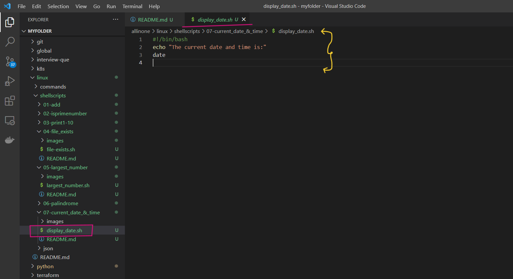
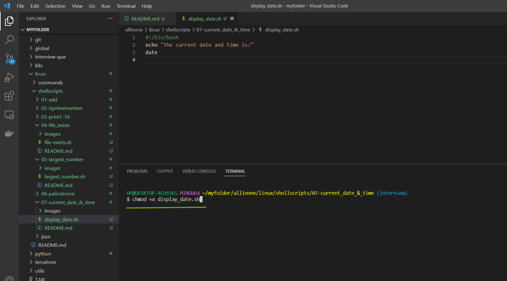
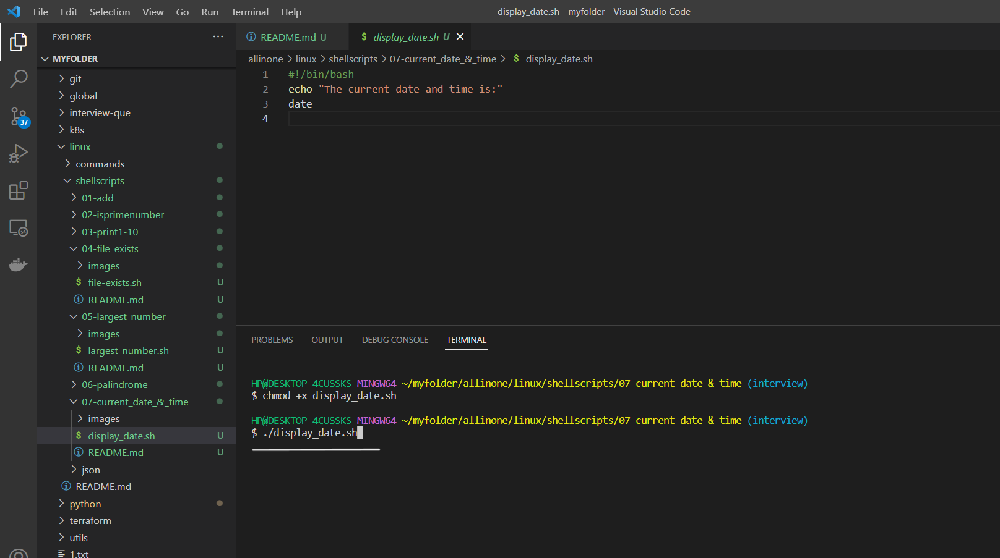
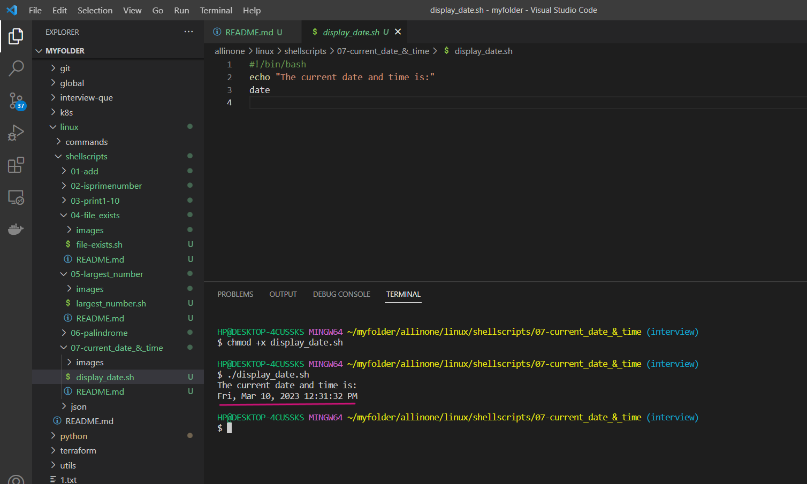

# Shell Script to Display Current Date and Time

### This is a simple shell script that displays the current date and time using the date command.

# Introduction

## What is Shell scripting ?

Shell scripting is a way to automate repetitive tasks or perform a series of commands in a specific sequence by writing a script or program in a shell language.

A shell script is essentially a computer program written in a shell language (e.g., Bash, Zsh, or Korn shell) that instructs the shell how to perform a series of tasks. These tasks may include manipulating files, processing text, executing commands, or even controlling other programs.

Shell scripts are useful for a wide range of tasks, such as automating backups, running system maintenance tasks, and installing software. They are widely used in the Unix and Linux environments, but can also be used on other operating systems such as Windows, with the appropriate shell or command-line interface


# Pre-requisites

- ### This script requires Bash to be installed on your system.

# How to Run

- ### To use this program, simply create a file called  `display_date.sh` and add the script to it .





- ### Open the terminal and run the following command to make it executable  `chmod +x display_date.sh`  Then you can run it like this:


```
chmod +x display_date.sh 
```



- ### Now lets run the following command to see the `Current Date and Time`.

```
./display_date.sh
```




- ### So, it shows the `Current Date and Time`.




# Description

- The above code is a shell script written in Bash that displays the current date and time using the `date` command.

- The script starts with a shebang line `#!/bin/bash` which specifies the interpreter that should be used to execute the script.

- The `echo` command is then used to display a message on the terminal informing the user that the current date and time will be displayed.

- Finally, the `date` command is used to display the current date and time on the terminal.

- The user can save the script in a file with a `.sh` extension, make it executable using `chmod +x`, and run it by typing `./display_date`.sh in the terminal.


# If

- If the execution permisssions are not there for the file, you will see below error

- permission denied: ./display_date.sh