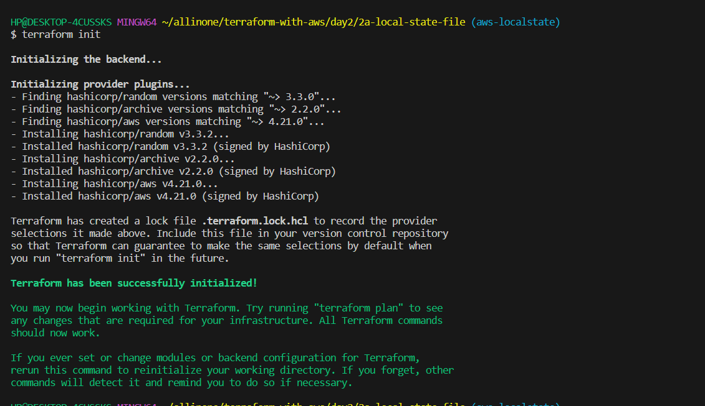
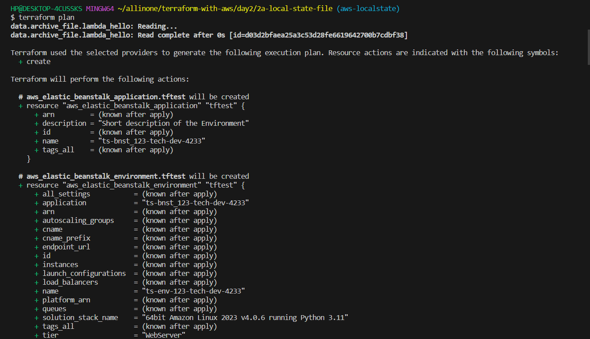
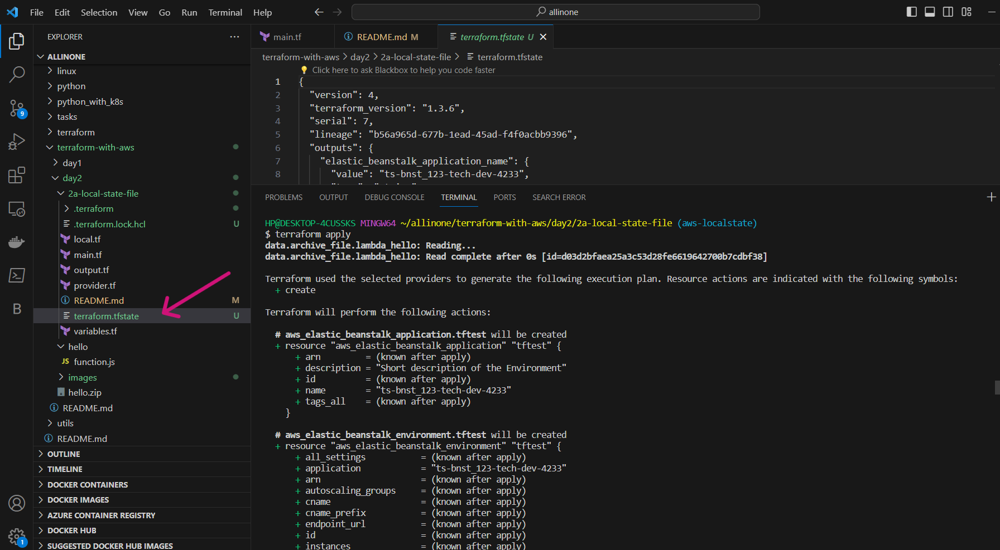
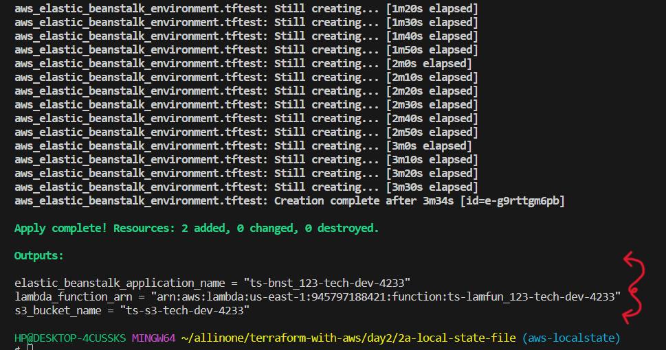
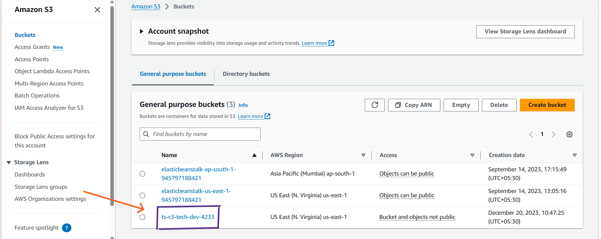
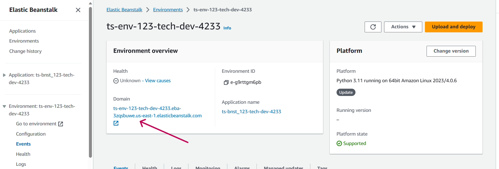
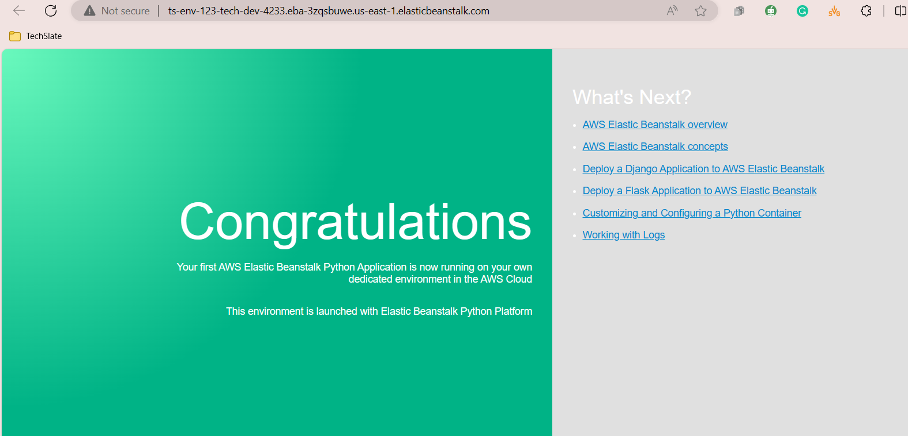

# <span style="color: Seagreen;">Terraform Script: Exploring local state file by creating ``Amazon S3 Bucket`` , ``AWS Lambda`` and ``AWS Elastic Beanstalk``.

# <span style="color: lightpink;">Introduction

- **What is ``Amazon S3 Bucket``** ?

    Amazon S3 is a scalable and highly durable object storage service provided by Amazon Web Services (AWS). It is designed to store and retrieve any amount of data from anywhere on the web. S3 is widely used for various purposes, including data storage, backup, archival, content distribution, and hosting static websites.
    A bucket is the fundamental container in Amazon S3 for storing data. Each bucket has a globally unique name within the S3 namespace. 

- **What is ``AWS Lambda``** ?

    Amazon Lambda, commonly known as AWS Lambda, is a serverless computing service provided by Amazon Web Services (AWS). It enables you to run your code without provisioning or managing servers. AWS Lambda automatically scales and manages the infrastructure required to run your applications, allowing you to focus on writing code and building functionality.

- **What is ``AWS Elastic Beanstalk``** ?

    AWS Elastic Beanstalk is a fully managed service that makes it easy to deploy, run, and scale web applications and services. It abstracts the complexities of infrastructure management, allowing developers to focus on writing code rather than dealing with the underlying infrastructure.


# <span style="color: lightpink;">Pre-requisites

- **An active AWS account.**
- **AWS CLI and Terraform installed on your machine.**
- **AWS IAM user with the necessary permissions and access key credentials.**
- **Run ``aws configure``** and give the respective ``Access Key`` and ``Secret Key`` .

# <span style="color: lightpink;">Process

- **Open the `main.tf` file and edit the following variables as needed:**

## `main.tf`
```
resource "aws_s3_bucket" "bucket" {
  bucket        = local.bucket_name
  force_destroy = var.force_destroy
}

resource "aws_s3_bucket_public_access_block" "bucket" {
  bucket = aws_s3_bucket.bucket.id

  block_public_acls       = var.block_public_acls
  block_public_policy     = var.block_public_policy
  ignore_public_acls      = var.ignore_public_acls
  restrict_public_buckets = var.restrict_public_buckets
}
resource "aws_iam_role" "hello_lambda_exec" {
  name = local.lambda_name

  assume_role_policy = <<POLICY
{
  "Version": "2012-10-17",
  "Statement": [
    {
      "Effect": "Allow",
      "Principal": {
        "Service": "lambda.amazonaws.com"
      },
      "Action": "sts:AssumeRole"
    }
  ]
}
POLICY
}

resource "aws_iam_role_policy_attachment" "hello_lambda_policy" {
  role       = aws_iam_role.hello_lambda_exec.name
  policy_arn = "arn:aws:iam::aws:policy/service-role/AWSLambdaBasicExecutionRole"
}

resource "aws_lambda_function" "hello" {
  function_name = local.function_name

  s3_bucket = aws_s3_bucket.bucket.id
  s3_key    = aws_s3_object.lambda_hello.key

  runtime = "nodejs16.x"
  handler = "function.handler"
  role = aws_iam_role.hello_lambda_exec.arn
}

data "archive_file" "lambda_hello" {
  type = "zip"

  source_dir  = "../hello"
  output_path = "../hello.zip"
}

resource "aws_s3_object" "lambda_hello" {
  bucket = aws_s3_bucket.bucket.id

  key    = "hello.zip"
  source = data.archive_file.lambda_hello.output_path

  etag = filemd5(data.archive_file.lambda_hello.output_path)
}

resource "aws_elastic_beanstalk_application" "tftest" {
  name        = local.beanstalk_name
  description = "Short description of the Environment"
}

resource "aws_elastic_beanstalk_environment" "tftest" {
  name                = local.environment_name
  application        = aws_elastic_beanstalk_application.tftest.name
  solution_stack_name = "64bit Amazon Linux 2023 v4.0.6 running Python 3.11"

  setting {
    namespace = "aws:autoscaling:launchconfiguration"
    name      = "IamInstanceProfile"
    value     = aws_iam_instance_profile.eb_instance_profile.name
  
}
}

resource "aws_iam_role" "eb_instance_role" {
  name = "eb-instance-role"

  assume_role_policy = jsonencode({
    Version = "2012-10-17",
    Statement = [
      {
        Action = "sts:AssumeRole",
        Effect = "Allow",
        Principal = {
          Service = "ec2.amazonaws.com"
        }
      }
    ]
  })
}

resource "aws_iam_instance_profile" "eb_instance_profile" {
  name = "eb-instance-profile"

  role = aws_iam_role.eb_instance_role.name  
}

```
- **Open the `variables.tf` file and edit the following variables as needed:**


## `variables.tf`

```

variable "env" {
  type        = string
  description = "The environment in which the application is being deployed. For example, 'prod' or 'dev'."
  default     = "dev"
}

variable "s3_prefix" {
  type  = string
  default = "tech"
}

variable "bnst_prefix" {
  type  = string
  default = "4233"
}

variable "force_destroy" {
  description = "Destroy all objects in the S3 bucket when the bucket is destroyed"
  type        = bool
  default     = true
}

variable  "block_public_acls" {
  type        = bool
  default     = true
}

variable  "block_public_policy" {
  type        = bool
  default     = true
}

variable  "ignore_public_acls" {
  type        = bool
  default     = true
}

variable  "restrict_public_buckets" {
  type        = bool
  default     = true
}

```

- **Open the `outputs.tf` file and edit the following variables as needed:**


## `outputs.tf`

```
output "s3_bucket_name" {
  value = aws_s3_bucket.bucket.bucket
}
output "lambda_function_arn" {
  value = aws_lambda_function.hello.arn
}
output "elastic_beanstalk_application_name" {
  value = aws_elastic_beanstalk_application.tftest.name
}
```

- **Open the `local.tf` file and edit the following variables as needed:**


## `local.tf`

```
locals {
  org_name             = "ts"  
 bucket_name = "${local.org_name}-s3-${var.s3_prefix}-${var.env}-${var.bnst_prefix}"
 beanstalk_name = "${local.org_name}-bnst_123-${var.s3_prefix}-${var.env}-${var.bnst_prefix}"
 lambda_name = "${local.org_name}-lambda_123-${var.s3_prefix}-${var.env}-${var.bnst_prefix}"
 function_name = "${local.org_name}-lamfun_123-${var.s3_prefix}-${var.env}-${var.bnst_prefix}"
 environment_name = "${local.org_name}-env-123-${var.s3_prefix}-${var.env}-${var.bnst_prefix}"
}
```

- **Open the `provider.tf` file and edit the following variables as needed:**


## `provider.tf`

```
terraform {
  required_providers {
    aws = {
      source  = "hashicorp/aws"
      version = "~> 4.21.0"
    }
    random = {
      source  = "hashicorp/random"
      version = "~> 3.3.0"
    }
    archive = {
      source  = "hashicorp/archive"
      version = "~> 2.2.0"
    }
  }

  required_version = "~> 1.0"
}

provider "aws" {
  region = "us-east-1"
}

```

# Terraform Commands

- ### Initialize

```
terraform init
```


*** 

- ### Validate

```
terraform validate
```


- ### Plan

```
terraform plan
```


- ### Apply

```
terraform apply
```

## After Apply , you can see resources getting created and terraform state is been created which describes about the resources created.





## Lets's direct to the AWS Console , and see whether the resources are reflecting one by one

### - **``S3 Bucket``** (ts-s3-tech-dev-4233)



### - **``AWS Lambda``** (ts-lamfun_123-tech-dev-4233)


### - **``AWS Elastic Beanstalk``**. Application ``(ts-bnst_123-tech-dev-4233)`` and Environment ``(ts-env-123-tech-dev-4233)`` .


### - **Open the Environment and access the Domain** .



### - **The Application running successfully** .

